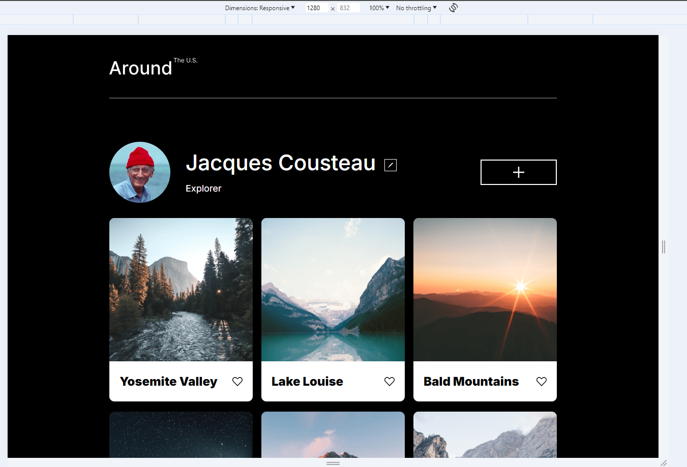
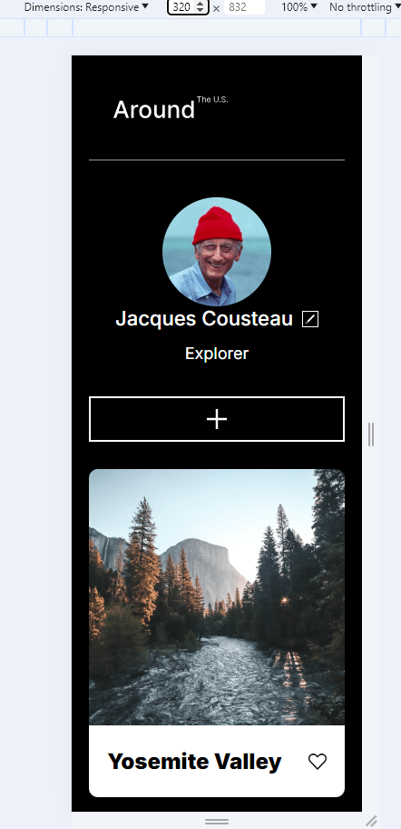

# Project: Around The U.S.

## Photo Gallery of **Jacques Cousteau's** Places Traveled.

### **Description of Project**: 
#### This project was part of the Adaptive Web Design Sprint and focused on building essential skills in HTML, CSS, JavaScript, and design tools like Figma and VSCode. By the end of Sprint 3, I had developed a solid foundation in HTML and CSS for web development. In Sprint 5, I enhanced the project with JavaScript to add interactivity, including creating modals for adding new cards, editing profile information, and previewing card images.

## Photo Gallery of **Jacques Cousteau's** Places Traveled.

## **Skills and Knowledge Gained**

### Project Requirements:
#### Instead of a traditional PDF brief, I used a Figma page to outline all project specifications, ensuring a clear visual representation of the layout and design.

### **Responsive Design:**
#### - Media Queries: Ensured the page layout was adaptive across various screen sizes (desktop, tablet, and mobile) by implementing media queries that rearranged elements based on screen width.
#### - Flexible Dimensions: Used relative units like max-width, minmax, and auto to allow the layout to resize naturally without causing text or images to wrap inappropriately. 
#### - Text Wrapping Prevention: Utilized CSS properties such as text-overflow: ellipsis, white-space: nowrap, and overflow: hidden to manage text behavior effectively.

### Grid Layout:
#### Grid Structure: Leveraged the display: grid CSS property to design the page layout for adaptive web design.
#### Grid Properties: Applied grid-related properties such as grid-template-areas, grid-area, grid-template-columns/rows, and grid-gap to manage the card section and profile information layout.

### Custom Fonts:
#### Incorporated third-party fonts using the @font-face rule, setting the entire page to use the Inter font family with various font weights and styles.

### JavaScript Skills

#### Variables: Learned how to declare variables with var, let, and const, and gained a deeper understanding of their scopes.
#### Data Types: Explored primitive data types like string, number, boolean, null, undefined, and symbol.

#### Developed a strong understanding of complex data types like objects, arrays, and functions.
#### Functions: Gained proficiency in function declarations and expressions.
#### Objects and Arrays: Created and manipulated objects and arrays, learning about their properties and methods for efficient data handling.
#### DOM Manipulation: Mastered selecting and manipulating DOM elements using methods like getElementById and querySelector.
#### Understood event handling through addEventListener, making the project interactive and dynamic.

### \* [Link to my Project](https://danzellc.github.io/se_project_aroundtheus/)

### \* [Link to Project Figma](https://www.figma.com/file/ii4xxsJ0ghevUOcssTlHZv/Sprint-3%3A-Around-the-US?type=design&node-id=0-1&mode=design&t=RifMc0rS5YsAwoxO-0)

### \* [Link to my Explainer Video](https://drive.google.com/file/d/1Klm6RztptL-Xpr2NqRWSrMbtzvlLxC-T/view?usp=sharing)

### Thanks for viewing my project!
