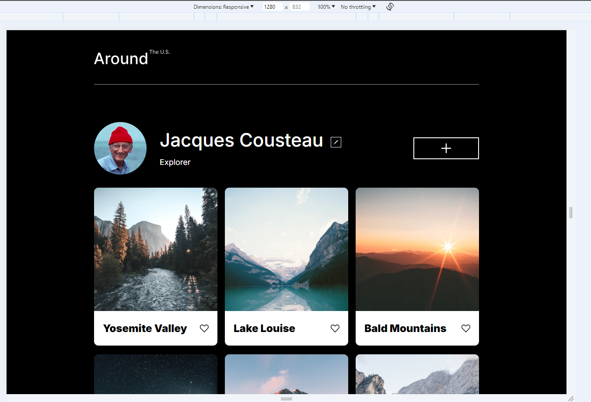
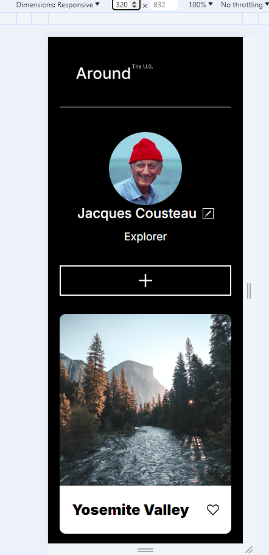

# Project 3: Around The U.S.

## Photo Gallery of **Jacques Cousteau's** Places Traveled.

### **Description of Project**: I utilized HTML and CSS for this project. I ensured the website compatibility can function across multiple screen sizes using media queries which was a challenging task but a rewarding experience.

### \* [Link to my Github Page](https://danzellc.github.io/se_project_aroundtheus/)

### \* [Link to Project Figma](https://www.figma.com/file/ii4xxsJ0ghevUOcssTlHZv/Sprint-3%3A-Around-the-US?type=design&node-id=0-1&mode=design&t=RifMc0rS5YsAwoxO-0)

### \* [Link to my Explainer Video](https://drive.google.com/file/d/1Klm6RztptL-Xpr2NqRWSrMbtzvlLxC-T/view?usp=sharing)

### Thanks for viewing my project!
